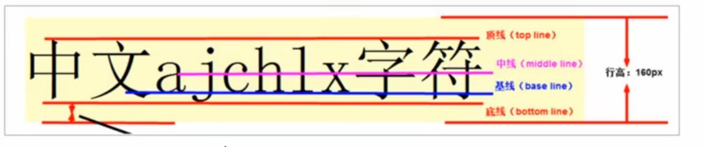

### vertical-align属性应用
* vertical-align 经常用于设置图片或者表单(行内块元素)和文字垂直对齐
* vertical-align 只针对行内元素或者行内块元素有效
```css
span{
    vertical-align: baseline | top | middle | bottom
}
```
* baseline 默认值，元素放置在父元素的基线上
* top 把元素的顶端与行中最高元素的顶端对齐
* middle 把次元素放置在父元素的中部
* bottom 把元素的顶端与行中最低的元素的顶端对齐 

