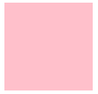

### 浮动
>浮动(float)属性用于创建浮动框，将其移动到一边，直到左边缘或右边缘触及包含块或另一个浮动框的边缘。浮动的盒子只会影响浮动盒子后面的标准流不会影响前面的标准流。浮动设计之初的目的是：让文字围绕图片。    
```css
div{
    float: left | right;
}
```
#### 浮动的特性
* 浮动元素会脱离文档流
* 浮动的元素会一行内显示并且元素顶部对齐,浮动的元素是互相贴靠在一起的（不会有缝隙），如果父级宽度装不下这些浮动的盒子，多出的盒子会另起一行对齐
* 浮动的元素会具有行内块元素的特性
<hr>    

#### 浮动的元素局用行内块元素的特点
```css
span{
    /*给行内元素span设置浮动后就具有了行内块元素的特点 所以可以设置宽高*/
    float:left;
    width:100px;
    height:100px;
    background-color:pink;
}
```
  
<hr>    

#### 浮动带来的影响
* 如果父盒子没有设置高度，子元素设置浮动后，会导致父盒子没有被撑开，就会影响下面的标准流，则需要清除浮动
* 如果父盒子本身有高度，则不需要清除浮动

#### 清除浮动的方法
1. 在最后一个浮动元素后面添加一个空标签，并设置CSS的clear属性值为both   
    * 优点：简单方便
    * 缺点：新增无用的空标签
    ```css
    .box1{
        width: 100px;
        height: 100px;
        background-color: gray;
        float: left;
    }
    .box2{
        width: 150px;
        height: 150px;
        background-color: hotpink;
    }
    .clear{
        clear:both;
    }
    ```
    ```html
    <div class="box">
        <div class="box1"></div>
        <div class="box2"></div>
        <div class="clear"></div>
    </div>
    ```
2. 给父盒子添加overflow属性并将值设为hidden 
    * 优点：代码量少
    * 缺点：溢出部分无法显示
    ```css
    .box{
        overflow:hidden;
    }
    .box1{
        width: 100px;
        height: 100px;
        background-color: gray;
        float: left;
    }
    .box2{
        width: 150px;
        height: 150px;
        background-color: hotpink;
    }
    ```
    ```html
    <div class="box">
        <div class="box1"></div>
        <div class="box2"></div>
    </div>
    ```
3. :after伪元素清除法，该方法是添加额外标签的升级版，推荐使用。也是给父元素添加
     ```css
    .clearfix:after{
        display: block;
        content: '';
        clear: both;
    }
        /*兼容IE6 7*/
    .clearfix{
        *zoom: 1;
    }
    .box1{
        width: 100px;
        height: 100px;
        background-color: gray;
        float: left;
    }
    .box2{
        width: 150px;
        height: 150px;
        background-color: hotpink;
    }
    ```
    ```html
    <div class="box clearfix">
        <div class="box1"></div>
        <div class="box2"></div>
    </div>
    ```
4. :before 和 :after双伪元素清除法，原理跟:after伪元素清除法一样。
     ```css
    .clearfix:before,.clearfix:after{
        display: block;
        content: '';
        clear: both;
    }
        /*兼容IE6 7*/
    .clearfix{
        *zoom: 1;
    }
    .box1{
        width: 100px;
        height: 100px;
        background-color: gray;
        float: left;
    }
    .box2{
        width: 150px;
        height: 150px;
        background-color: hotpink;
    }
    ```
    ```html
    <div class="box clearfix">
        <div class="box1"></div>
        <div class="box2"></div>
    </div>
    ```