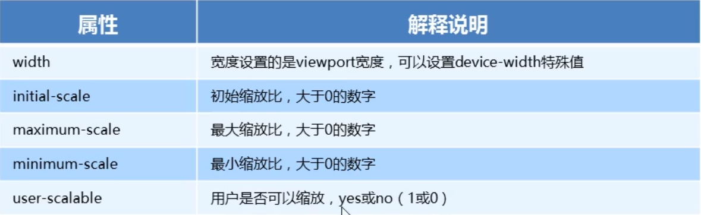

### 移动端基础

#### 视口
* 视口就是浏览器显示页面内容的屏幕区域
* 视口分为布局视口、视觉视口和理想视口
* 移动端布局想要的是理想视口就是手机屏幕有多宽，我们的布局视口就有多宽
* 想要设置理想视口，我们需要给我们的移动端页面添加meta视口标签
<hr>

#### meta视口标签
```html
<meta name="viewport" content="width=device-width, initial-scale=1.0, user-scalable=no,maximum-scale=1.0,minimum-scale=1.0">
```


#### 标准的viewport设置
* 视口宽度和设置保持一致
* 视口的默认缩放比例1.0 
* 不允许用户自行缩放
* 最大允许的缩放比例1.0
* 最小允许的缩放比例1.0
<hr>

#### 物理像素&物理像素比
* 物理像素点指的是屏幕显示的最小颗粒，是物理真实存在的。这是手机出厂时就设置好的
* 我们开发时候的1px不一定等于1个物理像素的
* PC端页面，1px等于1个物理像素，但移动端就不尽相同
* 1px能显示的物理像素点的个数，称为物理像素比或屏幕像素比
<hr>

#### 多倍图原理

由于Retina（视网膜屏幕）技术的出现，可以将更多的物理像素点压缩至一块屏幕里，从而达到更高的分辨率，并提高屏幕显示的细腻程度。

#### 多倍图解决方法
* 对于一张 50px * 50px的图片，在一个ddr(物理像素比)为2的视网膜屏幕中，这个时候图片会放大两倍，从而造成图片模糊。
* 所以在标准的viewport设置中，使用倍图来提高图片质量，解决图片在高清设备中的模糊问题
```css
/*以 iphone8 为例 ddr=2*/
img{
    /* 原始图片100px*100px */
    width:50px;
    height:50px;
}
/*通过background-size对背景图片进行缩放*/
img{
    /*也可以用百分比单位*/
    background-size: 50px 50px;
}
```
<hr>    

#### 流式布局(百分比布局)
* 流式布局，也称为百分比布局，也称为非固定像素布局
* 通过盒子的宽度设置成百分比来根据屏幕的宽度来进行伸缩，不受固定像素的限制，内容向两侧填充
* 流式布局方式是移动web开发使用的比较常见的布局方式
* 通过 max-width 最大宽度(max-height 最大高度) 限制最大宽度/高度
* 通过 min-width 最小宽度(min-height 最小高度) 限制最小宽度/高度

#### 二倍精灵图做法
* 把精灵图等比例缩放为原来的一半
* 之后根据大小测量坐标
* 代码里background-size也要写：精灵图原来宽度的一半
<hr>

#### rem和em
* em相对于父元素的字体大小来说的  
* rem相对于HTML根元素的字体大小来说的
