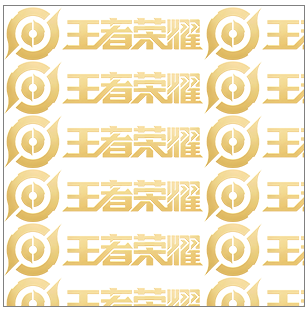

### CSS背景图片

#### background-image属性 设置背景图片

``` css
div {
    width: 300px;
    height: 300px;
    border: 1px solid gray;
    background-image: url(image/logo.png); /*背景图片默认平铺*/
}
```

<hr>    

#### background-repeat属性 设置背景图片平铺情况
* no-repeat 背景图片不平铺
* repeat-x 背景图片沿X轴平铺
* repeat-y 背景图片沿Y轴平铺
<hr >   
背景图片不平铺  

```css
 div {
    width: 300px;
    height: 300px;
    border: 1px solid gray;
    background-image: url(image/logo.png); 
    background-repeat: no-repeat;
 }
```

<hr>
背景图片沿X轴平铺       

```css
 div {
    width: 300px;
    height: 300px;
    border: 1px solid gray;
    background-image: url(image/logo.png); 
    background-repeat: repeat-x;
 }
```

<hr>
背景图片沿Y轴平铺       

```css
 div {
    width: 300px;
    height: 300px;
    border: 1px solid gray;
    background-image: url(image/logo.png); 
    background-repeat: repeat-y;
 }
```

<hr>

#### background-position 属性 设置背景图片的位置
background-position: x y; X和Y可以是精确单位，也可以是top，right，bottom，left。这些名词单位
```css
/*设置背景图片水平靠右下角显示*/
 div {
    width: 300px;
    height: 300px;
    border: 1px solid gray;
    background-image: url(image/logo.png); 
    background-repeat: no-repeat;
    background-position: right bottom;
 }
```

<hr>    
使用精确单位设置背景图片的位置  

```css
 div {
    width: 300px;
    height: 300px;
    border: 1px solid gray;
    background-image: url(image/logo.png); 
    background-repeat: no-repeat;
    /*背景图片距离X轴50px 距离Y轴100px*/
    background-position: 50px 100px;
 }
```
<hr>

#### background-attachment 属性 设置背景是否固定
* scroll 背景图片随着页面的滚动而滚动，这是默认的
* fixed 背景图片不会随着页面的滚动而滚动
<hr>

#### 背景色半透明
```css
div{
   /*取值为0-1 0为透明 1不透明*/
   background: rgba(0,0,0,0.3)
}
```