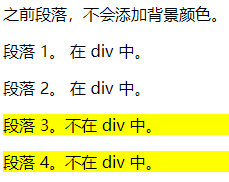

### CSS选择器

* 后代选择器（以空格分隔）
* 子元素选择器（以大于号>分隔）
* 相邻兄弟选择器（以加号+分隔），可以用来选择紧接在另一个元素后的元素，且二者有相同的父元素
* 后续兄弟选择器（以波浪号~分隔），可以用来选择所有指定元素之后的相邻兄弟元素
* 锚伪类    
    - a:link
    - a:visited
    - a:hover
    - a:active
* first-of-type伪类，p:first-of-type 选择每个P元素是其父元素的第一个P元素
* last-of-type伪类，p:last-of-type 选择每个P元素是其父元素的最后一个P元素
* first-child伪类，p:fisrt-child 选择每个P元素是其父元素的第一个子元素
* nth-child(n)伪类，p:nth-child 选择每个p元素是其父元素的第二个子元素
* nth-last-child(n)伪类，从后面算起第几个伪类
<hr>

#### 后代选择器 

``` css
div p {
    background-color: yellow;
}
```

``` html
<div>
    <p>段落 1。 在 div 中。</p>
    <p>段落 2。 在 div 中。</p>
</div>

<p>段落 3。不在 div 中。</p>
<p>段落 4。不在 div 中。</p>
```


 
<hr>

#### 子元素选择器

``` css
div>p {
    background-color: yellow;
}
```

``` html
    <div>
        <p>段落 1。 在 div 中。</p>
        <span>
            <p>段落 2。 在 div 中。</p>
        </span>
    </div>

    <p>段落 3。不在 div 中。</p>
    <p>段落 4。不在 div 中。</p>
```


<hr>

#### 相邻兄弟选择器 

``` css
/* 选择div后的第一个p元素 */
div+p {
    background-color: yellow;
}
```

``` html
<div>
    <h2>DIV 内部标题</h2>
    <p>DIV 内部段落。</p>
</div>

<p>DIV 之后的第一个 P 元素。</p>

<p>DIV 之后的第二个 P 元素。</p>
```


<hr>    

#### 后续兄弟选择器

``` css
div~p {
    background-color: yellow;
}
```

``` html
<p>之前段落，不会添加背景颜色。</p>
<div>
    <p>段落 1。 在 div 中。</p>
    <p>段落 2。 在 div 中。</p>
</div>

<p>段落 3。不在 div 中。</p>
<p>段落 4。不在 div 中。</p>
```



<hr>

#### 锚伪类

``` css
a:link {
    color: #FF0000
}

/* 未访问的链接 */
a:visited {
    color: #00FF00
}

/* 已访问的链接 */
a:hover {
    color: #FF00FF
}

/* 鼠标移动到链接上 */
a:active {
    color: #0000FF
}

/* 选定的链接 */
```

但需要注意的是在CSS中，a:hover 必须被置于 a:link 和 a:visited之后才是有效的。 a:active必须被置于a:hover之后才是有效的   
<hr>    

#### first-of-type 伪类

``` css
/*选择P元素是其父元素的第一个P元素*/
p:first-of-type {
    background-color: yellow;
}
```
``` html
<p>之前段落，不会添加背景颜色。</p>
<div>
    <p>段落 1。 在 div 中。</p>
    <p>段落 2。 在 div 中。</p>
</div>

<p>段落 3。不在 div 中。</p>
<p>段落 4。不在 div 中。</p>
```

